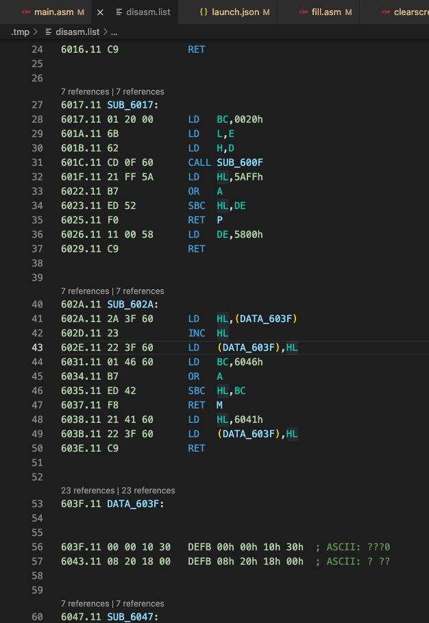
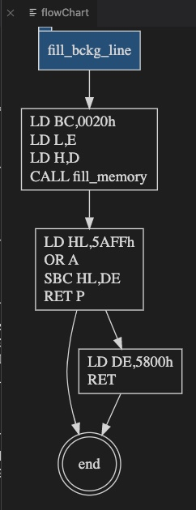
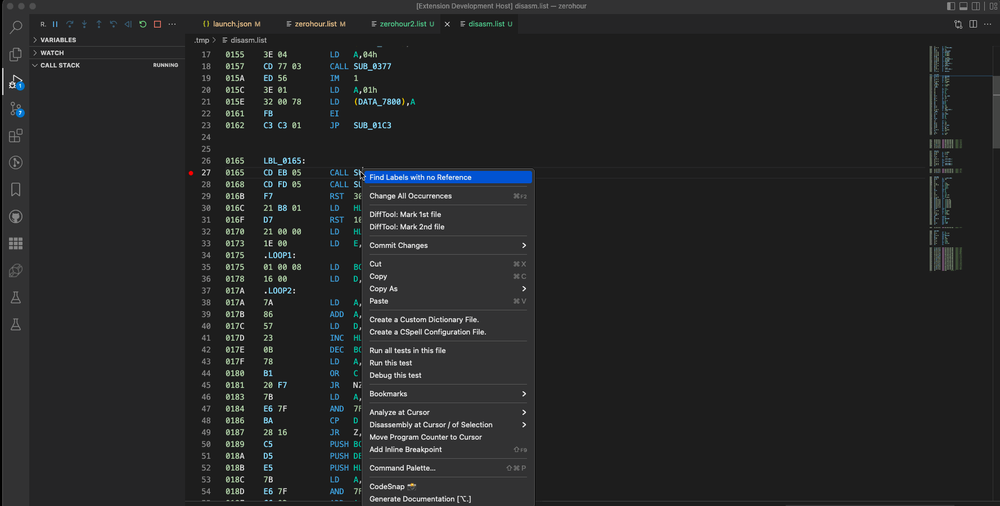
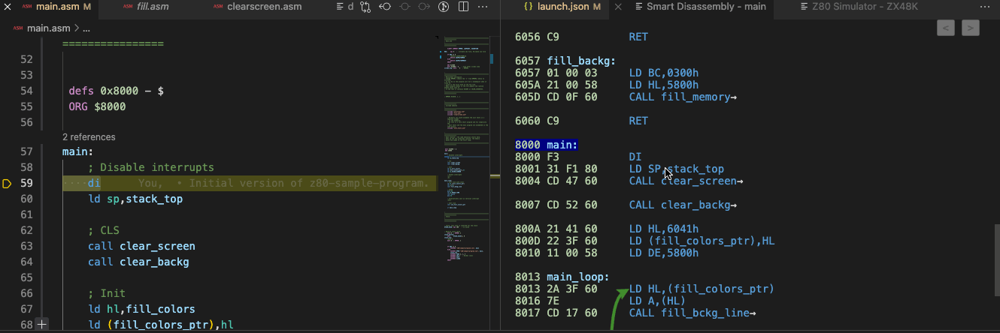

# Reverse Engineering with DeZog

Up to version 2.x DeZog was primarily used to develop and debug **new** Z80 SW.

Since version 3 DeZog can also be used for reverse engineering of existing SW.


When reverse engineering existing SW, all object code is already available, while the source code, i.e. the commented assembler sources, usually do not exist.
The goal of reverse engineering is to discover the purpose of the binary code through disassembly and debugging.
Once a subroutine is understood, it can be commented, labels can be renamed to more meaningful names, and the disassembly can be saved.

The commented disassembly is reloaded and used as a source for further stepping. Again, the new labels are used.

As more of the binary is understood, the list file becomes more complete, until hopefully all the code is commented and understood at the end.


To make it even clearer: There are 2 main differences to developing a new program with an assembler.
- Instead of running the assembler on your .asm file(s) you have to write the reverse engineered assembler file, a list file, yourself. DeZog assists you by providing a disassembly of the source code you are currently examining. This disassembly can be copied into your list file along with comments and renamed labels to make it human readable.
- While the debug session is running, you can re-load the list file and its labels. That is, once you have commented the disassembly or renamed the labels, they are used immediately. This greatly improves the turnaround cycle.


# Exemplary Process

The process is shown here using MAME as an example.

This example assumes that MAME is started manually or in a while loop with a ROM (in this case pacman).
~~~bash
while true; do ./mame pacman -window -debugger gdbstub -debug -debugger_port 12000 -verbose ; sleep 2 ; done
~~~


The launch.json for DeZog is:
~~~json
{
    "version": "0.2.0",
    "configurations": [
        {
            "type": "dezog",
            "request": "launch",
            "name": "MAME",
            "remoteType": "mame",
            "mame": {
                "port": 12000
            },
            "startAutomatically": false,
            "revEng": [
                {
                    "path": "pacman.list"
                }
            ],
            "rootFolder": "${workspaceFolder}"
        }
    ]
}
~~~


Start with an empty pacman.list file.

1. Start MAME (while loop)
2. Start a DeZog debug session
3. Step, understand code
4. Copy understood code from disasm.list to pacman.list
5. Work on the code in pacman.list
	- Comment the code
	- Exchange label names with more meaningful names.
6. Save pacman.list
7. Reload the list file. In the command palette type: ```DeZog: reload the list file(s).```
At this point, DeZog will reload the symbols and also perform a new disassembly: The code from the pacman.list will be removed from the disassembly. So when stepping, the pacman.list is used whenever the PC points to code in that file.
The rest of the disassembly will also use the new labels.
8. Goto 3

Notes:
- The reloading of the list file takes place while the debug session is still active. I.e. you can simply continue debugging.
- Instead of manual reloading it is also possible to add ```"reloadOnSave": true``` to "revEng". In this case the labels will be reloaded automatically every time "pacman.list" is saved.


# Disassembly
The disassembly fetches the entire 64k memory from the remote for disassembly.
DeZog does its best to analyze the code intelligently and disassemble the entire code.

It starts with the first PC address it encounters. If all the code is accessible from there, DeZog will disassemble all the code.



There are a few caveats, however:
- Interrupts: The interrupt address is not known at the beginning. That is, unless you break into the interrupt, DeZog will not be able to disassemble the code.
- The same is true for ```JP (HL)```. The jump address is only available during runtime. Therefore, DeZog cannot disassemble it before execution.
- Self-modifying code. DeZog does not fetch and disassemble the code at each step. Therefore, if the code is self-modifying, you may not see the correct disassembly. If the code looks suspicious, you can manually refresh the disassembly by clicking the refresh button  at the top right of the disasm.list file.
- For the same reason (Dezog does not fetch and disassemble the code at each step), the data portions in the disassembly may not be up-to-date. If in doubt, update the disassembly again.

To keep the disassembly up-to-date most of the time DeZog decides to automatically update the disassembly under the following occasions:
- The slots (i.e. the current banking/paging) change.
- The memory contents at the current PC has changed.
- The PC is at a former unknown, not disassembled, address (e.g. at an interrupt).

Anyhow: If in doubt that the disassembly is recent you can also compare it with the (brute force) disassembly in the VARIABLE pane, e.g.:


which is **always** up-to-date.


## Disassembly after a break

If you run the program and then manually pause or a breakpoint is reached, DeZog may not be able to show you the previous lines because it simply does not know which addresses have been executed recently.
In such cases, you will see the disassembly directly from the current PC without any previous lines.
But of course, you often want to know how you got here.
There are a few ways you can deal with this:
- a) Use 'zsim: the internal simulator keeps a list of the most recently executed addresses used by DeZog for disassembly.
- b) Use the command '-dasm' in the debug console: Simply specify an address slightly before that of the current PC (program counter). 'dasm' will perform a brute force disassembly. But this only works if the 'dasm' address is not too far away from the current PC. And of course it can fail because Z80 commands can be up to 4 bytes long, so you might choose an address somewhere in the middle of a command. In that case, try a slightly different address.
c) Use '-dasm', but also take a look at the callstack and use the address from the callstack.


# Breakpoints

Breakpoints can be set as usual via the Vscode editor.
Breakpoints can be set either in the disassembly or in the list file.

Breakpoints "survive" in the disassembly, even if the disassembly is updated.
Breakpoints in the disasm.list file are deleted after a debug session.

If you need to set a breakpoint in a location that is not present in either the disassembly or the list file, you can do the following:
1. in the list file, simply enter the address (in hex) at the beginning of a line.
2. save the list file
3. in the command palette, type: ```DeZog: reload the list file(s).```
4. set a breakpoint in the line of the address. The picture shows this for a breakpoint at address 0x8000:


# WPMEM, ASSERTION, LOGPOINT

These work the same way as in other list files.
For example, to add a permanent watchpoint to a memory location, use:
~~~asm
9000 00 00 00  data:    ; WPMEM
~~~

This will watch the memory at locations 9000h to 9002h.

Please note that you can also add temporary watchpoints with the debug command "-wpadd addr ...".


# Analysis

The DeZog smart disassembler is based on the [z80dismblr](https://github.com/maziac/z80dismblr), but has been heavily re-factored.
It provides more analysis features, namely flowcharts, call diagrams and the smart disassembly.

For all these functions:
Start Dezog, place the cursor in the source code at a statement, and right-click for "Analyze at Cursor":


Note: It depends a bit on the assembler parser used. Some DeZog parsers allow disassembly directly from a line with a label, others require that there is also an assembly instruction on that line.
If you get a message in the DEBUG CONSOLE like this: ```Error: No address found at line.```, then try again by right-clicking directly on an assembly instruction.

The following examples use the [z80-sample-program](https://github.com/maziac/z80-sample-program) assembled for the ZX 48K.


## Call Graph

The following subroutine
~~~asm
fill_bckg_line:
    ld bc,BCKG_LINE_SIZE
    ld l,e
    ld h,d
    call fill_memory
    ; check that destination address is still in screen background
    ld hl,COLOR_SCREEN+COLOR_SCREEN_SIZE-1
    or a    ; clear carry
    sbc hl,de ; compare
    ret p
    ; ld start address
    ld de,COLOR_SCREEN
    ret
~~~

will result into this call graph:


I.e. it is indicated by an arrow that *fill_bckg_line* calls *fill_memory*.
Furthermore in the bubbles you'll find the start address and the size of the sub routine in bytes.

Here is a more advanced call graph from the main routine:

.

At the top of the call graph you also find a slider to adjust the shown call graph depth.


## Flow Chart

Here is the flow chart for the above subroutine:



And here another flowchart of the main routine:


## Smart Disassembly

The smart disassembly follows the execution flow starting at the specified address and visualizes the calls and jumps with arrows.

A smart disassembly of the *main loop* of the z80 sample program looks like this:


That is, you will automatically find the referenced *fill_bckg_line* and *inc_fill_colors_ptr* disassembled as well.

The disassembly also contains the referenced data of this subroutine (and referenced sub-subroutines).
I.e. even with self-developed code you can easily see to which memory it refers.

If labels already exist, these names are reused. If no labels exist yet, a name is "invented".

In theory, if you would do a smart disassembly of the entry point of the program (e.g., the *main*routine) you'd get a disassembly of the entire program.
In practice, of course, not all code is reachable with static analysis.
For example, the interrupt routine or all "JP (HL)" or even modified jumps cannot be followed/disassembled.

Here is a picture of a more complex example code:


The jumps are visualized by arrows. Backward jumps (loops) within the same subroutine are on the left.
Forward jumps on the right side.
Each call offers a small arrow. Hovering over it will animate an arrow to the called subroutine.
(Note: If the called routine is in a different slot and it is not 100% sure that the code in the slot is the correct one (it could have a wrong bank paged in), only the call address is shown without the arrow).

At the top you will find a slider that allows you to control the call depth of the disassembly.


## Selection

The animated gif below shows how the flowchart is created from a disassembly and how to navigate through the code by selecting the blocks in the flowchart or call diagram.

Flow chart example:


Call graph example:



Smart disassembly example: TODO: update gif:



Hint:
If the flow chart, call graph or smart disassembly is hidden once you do a selection then please enable the following vscode setting:
~~~
editor.revealIfOpen
~~~


## Note

Although these analysis functions are intended for reverse engineering, they can also be used for "own" code.
The visualization in a flow chart, call graph or even in the smart disassembly might be helpful as well.


# Reverse Engineering List File

The reverse engineering file is specified in the launch.json file with:
~~~json
"revEng": [
    {
        "path": "pacman.list"
    }
~~~

It is parsed by DeZog like other list files.
DeZog takes the label names from it and associates them with the address for that line.

Please note that you can also specify several entires with different paths or you can use a glob pattern to address several files in one entry.

## Addresses

The address is normally specified as a ```long address```. I.e. it also contains the bank/paging information.
Only if the address (slot) is unique (i.e. no banking supported), the bank information can be omitted.

Example without banking:
~~~list
8000  mylabel:
~~~

Example with banking:
~~~list
8000.9  mylabel:
~~~

I.e. the "9" is the bank. The name of the bank correspondents directly to the 'shortName' used in the memory model.
For custom memory models, please refer to [customMemory](Usage.md#customMemory).
Normally, the bank name is simply equal to the bank number unless otherwise specified, e.g. in 'customMemory'.

Here are the short names for the predefined memory models:
- RAM: there is only one large (RAM) bank. The bank numbers can be omitted.
- ZX16K/ZX48K: since the slots for ROM and RAM are bound to fixed banks, the bank numbers can be omitted.
- ZX128K: 128k ROM="R0", 48k ROM="R1", the other banks are numbered 0 to 7.
- ZXNEXT: 128k ROM="R0a"/"R0b", 48k ROM="R1a"/"R1b", ROM1="R1", the other banks are numbered from 0 to 223.
Note: The ROM size is 16k, but since the ZX Next has a slot size of 8k, the ROM is divided into an "a" and "b" part.
- COLECOVISION: The bank/slot configuration is unique. The bank numbers can be omitted.


## Bytes

After the address the used bytes can be specified. E.g.
~~~list
8000.9  21 AB CD
~~~

DeZog does not interpret the content of these bytes, but counts the number. simply to know which memory belongs to the CODE area.
In the above example, all 3 bytes are associated with the rev engineering file/line number (pacman.list).


## Mnemonic

The bytes are followed by the mnemonic (instruction).
E.g.
~~~list
8000.9  21 AB CD    ld hl,0xCDAB
~~~

The mnemonics have no special meaning to DeZog.
These are just to make the list file human readable.


## Labels

A label is recognized by the ':'

~~~list
8000.9  mylabel:
8000.9  21 AB CD    ld hl,0xCDAB
~~~

The label is directly linked to the address (8000.9).
As in the example above, it is possible to use several of the same address in different lines (as with normal list files).


## Comments

A comment is started with ';' or ('//').

~~~list
; mul_ab:  Multiplies a with b.
; Returns the result in hl.
8000.9  mul_ab:
~~~

Multiline comments are also supported ('/* ... */').

ASSERTION, WPMEM and LOGPOINT are supported and identified after a single line comment.
Inside multiline comments they are not found.


## Special Listfile Commands

DeZog understands a few special commands:

### 'SKIP' or 'SKIPWORD'

'SKIP' is used to tell DeZog that the code at the given address should be skipped and not disassembled.

This is useful if a CALL or a RST manipulates the return address on the stack.

~~~list
8000.9  CF          RST 08
8001.9              SKIP
8002.9  21 AB CD    LD HL,0xCDAB
~~~

In the example above the byte at 8001 is skipped. The disassembly continues at 8002.

SKIPWORD works the same but skips 2 bytes:
~~~list
8000.9  CF          RST 08
8001.9              SKIPWORD
8003.9  21 AB CD    LD HL,0xCDAB
~~~

Notes:
- The step-over also acknowledges the SKIP (or SKIPWORD).
- If you need to skip more than 2 bytes you can use several SKIP/SKIPWORD in sequence, e.g.:
    ~~~list
    8000.9  CF          RST 08
    8001.9              SKIPWORD
    8003.9              SKIPWORD
    8005.9              SKIP
    8006.9  21 AB CD    LD HL,0xCDAB
    ~~~

- You can have text before the SKIP or even any text after the SKIP. E.g. this is also valid:
    ~~~list
    8000.9  CF          RST 08
    8001.9  FF          SKIP [0xFF]
    8002.9  21 AB CD    LD HL,0xCDAB
    ~~~


### 'CODE'

'CODE' is used to tell DeZog that at a certain address code is starting.
Normally not all code can be found by DeZog itself.
In those case you can help DeZog by specifying CODE addresses.

This is useful e.g. to specify the start of a interrupt routine or e.g. code that is only reached through ```JP (HL)```.

Here the address 0x0066 will be disassembled by DeZog even if no current execution flow would lead to it:
~~~list
0066.R0 CODE
~~~

You can combine that with a label, of course:
~~~list
0066.R0 interrupt: CODE
~~~


# Misc

## Delta Search

The idea behind delta search is to search memory for strings that are not ASCII encoded.
The only assumption made is that the characters are in a standard order.

For a delta search, enter a string of at least 2 characters.
Then the deltas between the characters are taken and the memory is searched for a sequence with the same deltas.

Example:
"MIK" has the deltas:
- 'M' to 'I': -4
- 'I' to 'K': 2

When searching the following sequences would be found:
- 10, 6, 8
- 204, 200, 202
- "MIK"
- "mik"
- "njl"
- etc.

If you have a memory view open ("-mv address size") you can activate the delta search with the

symbol.

When you have identified a memory region that matches you can also "decode" that area in the debug console.
The command is "-mdelta address size string". E.g.
~~~
-mv C000h 256 MIK
~~~

This command searches for the sequence again, but additionally outputs the memory area with the offset found.
The offset is the first character of the search string subtracted from the memory value at the found position.
I.e. in the memory dump a "MIK" is output, even if the found string was "njl".
Not only the found string is output with the offset, but also all other memory values.

"So what's the point?"

Imagine you know only part of the string that is being used.
Or you know for sure that one string is included, but you don't know what the other strings are.
With the delta memory dump ("-mdelta"), the rest is also decoded and you can easily see where the other strings are.

In MAME games you can use this to find the highscore tables.
If you know one of the 3-letter gamer tags, you can easily locate the entire highscore table.


## Patching

Imagine you are reverse-engineering some existing binary file.
This could either be loaded on start of MAME or you load it from within DeZog e.g. with the "load" parameter in the launch.json.

Now you find an interesting part of the code that you want to change.
You could, of course, load the binary file in a hex editor, change it there and reload it.
But there is an easier way.

In launch.json you can specify the "commandsAfterLaunch" and you can use the "-msetb" command to change the memory directly after starting a new debug session.
For smaller changes this is very effective.

If you would like to do a bigger change you can use an assembler, e.g. sjasmplus, do generate e.g. a small subroutine, and load the code with the "loadObjs" parameter in the launch.json.
"loadObjs" is executed "load" so you can easily change any previously loaded memory.


## State Save and Restore

Very helpful in debugging/reverse engineering is the save/restore feature.
You can save the state of the debugged system with the command "-state save \<name\>" and restore it anytime with "-state restore \<name\>".

See [State Save/Restore](Usage.md/#state-save-restore).

Unfortunately, in MAME state save/restore is not available because of implementation details.


## Memory Model

There is a new debug console command to print the current used memory model. I.e. the used slot ranges and available banks together with their names.
This can be particular helpful in case MAME is used as remote.
Here is an example output:

~~~
-memmodel
Slot ranges:
0000-2FFF: unnamed, banks: R0
3000-37FF: unnamed, banks: R1
3800-3BFF: unnamed, banks: R2
3C00-3FFF: unnamed, banks: U
4000-43FF: unnamed, banks: R3
4400-FFFF: unnamed, banks: U
Memory banks:
R0: ROM0, size=12288, RAM
R1: ROM1, size=2048, RAM
R2: ROM2, size=1024, RAM
R3: ROM3, size=1024, RAM
U: UNASSIGNED, size=48128, RAM
~~~