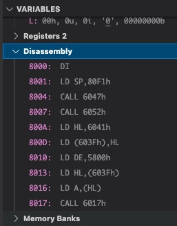
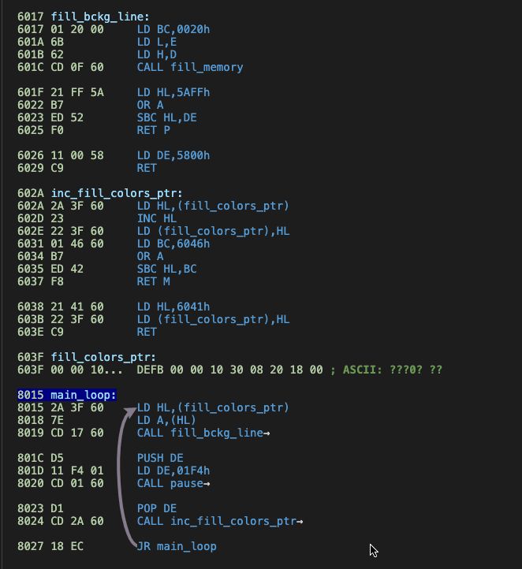
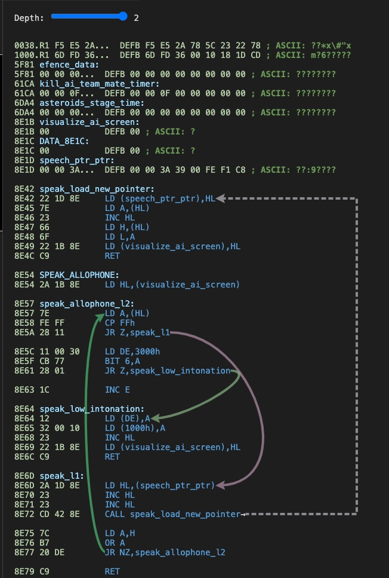
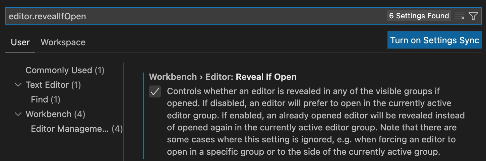

# Reverse Engineering with DeZog

Up to version 2.x DeZog's primary goal was to develop **new** Z80 SW and debug it.

Beginning with version 3 another way to use DeZog is for reverse engineering of existing SW.


When reverse engineering existing SW the whole object code already exists whereas the source code, i.e. the commented assembler sources normally do not exist.
The goal of reverse engineering is to discover the purpose of the binary code by disassembling and debugging it.
Once a sub routine has been understood it can be commented, labels can be renamed to more meaningful names and the disassembly can be saved.

These commented disassembly is reloaded and taken as source for the further stepping. Also the new labels are used.

The more of the binary is understood the more complete the list file becomes until at the end hopefully all code is commented and understood.


To make it more clear: there are 2 main differences to developing a new program with an assembler.
- Instead of running the assembler on your .asm file(s) you have to write the reverse engineered assembler file, **a list file**, yourself. DeZog supports you by providing a disassembly of the source code portion that you are currently investigating. This disassembly can be copied to your list file together with comments and renamed labels to make it human readable.
- While the debug session is running you can re-read the list file and it's labels. I.e. as soon as you have commented the disassembly or renamed labels they are immediately taken into use. This improves the turn-around cycle a lot.


# Exemplary Process

The process is shown here with MAME as an example.

This example assumes that MAME is started manually or in a while loop with a ROM (pacman in this case).
~~~bash
while true; do ./mame pacman -window -debugger gdbstub -debug -debugger_port 12000 -verbose ; sleep 2 ; done
~~~


The launch.json for DeZog is:
~~~json
{
    "version": "0.2.0",
    "configurations": [
        {
            "type": "dezog",
            "request": "launch",
            "name": "MAME",
            "remoteType": "mame",
            "mame": {
                "port": 12000
            },
            "startAutomatically": false,
            "revEng": [
                {
                    "path": "pacman.list"
                }
            ],
            "rootFolder": "${workspaceFolder}"
        }
    ]
}
~~~


Start with an empty pacman.list file.

1. Start MAME (while loop)
2. Start a DeZog debug session
3. Step, understand code
4. Copy understood code from disasm.list to pacman.list
5. Work on the code in pacman.list
	- Comment the code
	- Exchange label names with more meaningful names.
6. Save pacman.list
7. Reload the list file. In the command palette type: ```DeZog: reload the list file(s).```
At that point DeZog will re-read the symbols and also do a new disassembly: The code from the pacman.list is removed from the disassembly. So, when stepping the pacman.list is used whenever the PC points to code in that file.
The rest of the disassembly will also use the new labels.
7. Goto 3

Notes:
- The re-load of the list file takes place while the debug session is still active. I.e. you can simply continue with the debugging.
- Instead of reloading manually it is also possible to add ```"reloadOnSave": true```to "revEng". In this case the labels will be reloaded automatically on each save of "pacman.list".


# Disassembly

The disassembly fetches the complete 64k memory from the Remote for disassembly.
DeZog tries it's best to smartly analyze the code and disassemble the complete code.

It starts from the first PC address it encounters. If all code is reachable from there DeZog will disassemble the complete code.


But there are a few caveats:
- Interrupts: The interrupt address is not known at the beginning. I.e. as long as you do not break into the interrupt DeZog will not be able to disassemble the code.
- Same for ```JP (HL)```. The jump address is only available during run time. Therefore DeZog cannot disassemble this prior to execution.
- Self-modifying code. DeZog does not fetch and disassemble the code on every step. Therefore, in case of self-modifying code, you may not see the correct disassembly. If the code looks suspicious you can do a manual refresh of the disassembly by pressing the refresh button  in the top right of the disasm.list file.
- For the same reason (Dezog does not fetch and disassemble the code on every step) the data portions in the disassembly may not be up-to-date. In doubt re-fresh the disassembly.

To keep the disassembly up-to-date most of the time DeZog decides to automatically update the disassembly under the following occasions:
- The slots (i.e. the current banking/paging) change.
- The memory contents at the current PC has changed.
- The PC is at a former unknown, not disassembled, address (e.g. at an interrupt).

Anyhow: If in doubt that the disassembly is recent you can also compare it with the (brute force) disassembly in the VARIABLE pane, e.g.:

which is **always** up-to-date.


# Breakpoints

Breakpoints can be set via the vscode editor as normal.
Breakpoints can be set either in the disassembly or in the list file.

Breakpoints will "survive" in the disassembly even if the disassembly is updated.

If you need to set a breakpoint to some location that does not exist in either the disassembly or the list file then you can do the following:
1. In the list file just type in the address (in hex) at a start of a line.
2. In the command palette type: ```DeZog: reload the list file(s).```
3. Set a breakpoint at the line of the address. The picture shows this for a breakpoint at address 0x8000:


# WPMEM, ASSERTION, LOGPOINT

These all work the same as in other list files.
E.g. to add a permanent watchpoint to some memory location use:
~~~asm
9000 00 00 00  data:    ; WPMEM
~~~

This will watch memory at location 9000h to 9002h.

Please note that you can add temporary watchpoints also via the debug command "-wpadd addr ...".


# Analysis

The DeZog smart disassembler is based on the [z80dismblr](https://github.com/maziac/z80dismblr) but has been heavily re-factored.
This offers more analysing features, namely flowcharts, call graphs and smart disassembly.

For all of these features:
Start Dezog, place the cursor at the source code at some instruction and do a right click for "Analyze at Cursor":


Note: It depends a little bit on the assembly parser that is used. Some DeZog parsers allow a disassembly directly from a line with a label, others require that there is also an assembler instruction on that line.
If you get a note in the DEBUG CONSOLE like this: ```Error: No address found at line.``` than re-try by right-clicking directly over an assembler instruction.

The examples below use the [z80-sample-program](https://github.com/maziac/z80-sample-program) assembled for the ZX 48K.


## Call Graph

The following subroutine
~~~asm
fill_bckg_line:
    ld bc,BCKG_LINE_SIZE
    ld l,e
    ld h,d
    call fill_memory
    ; check that destination address is still in screen background
    ld hl,COLOR_SCREEN+COLOR_SCREEN_SIZE-1
    or a    ; clear carry
    sbc hl,de ; compare
    ret p
    ; ld start address
    ld de,COLOR_SCREEN
    ret
~~~

will result into this call graph:


I.e. it is indicated by an arrow that *fill_bckg_line* calls *fill_memory*.
Furthermore in the bubbles you'll find the start address and the size of the sub routine in bytes.

Here is a more advanced call graph from the main routine:
.

At the top of the call graph you also find a slider to adjust the shown call graph depth.


## Flow Chart

Here is the flow chart for the same subroutine:


And here another flowchart of the main routine:


## Smart Disassembly

The smart disassembly will follow the execution flow from the given address and visualize the calls and jumps with arrows.

A smart disassembly of the *main_loop* of the z80-sample-program looks like this:


I.e. you will automatically find also the referenced *fill_bckg_line* and *inc_fill_colors_ptr* disassembled.

The disassembly also contains the referenced data of that subroutine (and referenced sub-subroutines).
I.e. also for self-developed code you can easily see which memory it references.

If labels already exist those names are re-used. If labels do not exist yet a name will be "invented".

In theory, if you would do a smart disassembly of the entry point of your program  (e.g. the *main* routine), you'd get a disassembly of the whole program.
Of course, in practice, not all code is reachable from a static analysis-
E.g. the interrupt routine or any "JP (HL)" or self-modified jumps cannot be followed/disassembled.

Here is a picture of a more complex sample code:


The jumps are visualized through arrows. Backward (loop) jumps inside the same subroutine can be found on the left.
Forward jumps on the right.
Any call offers a little arrow. If hovered-over it animates an arrow to the called subroutine.
(Note: If the called routine is in another slot and it is not 100% sure that the code in the slot is the correct code (it might have paged in a wrong bank at the time of disassembly) than only the call address is shown without arrow.)

At the top you find a slider with which you can control the call-depth of the disassembly.


## Selection

The animated gif below shows how to create the flow chart from a disassembly and navigate through the code by selecting the blocks in the flow chart or call graph.

Flow chart example:


Call graph example:


Smart disassembly example:


Note:
The selection does work only on code for which a disassembly or a source file exists. If e.g. the disassembly shows too less code you might need to do a "smart disassembly" first and put that in your reverse engineered list file.

Hint:
If the flow chart, call graph or smart disassembly is hidden once you do a selection then please enable the following vscode setting:
~~~
editor.revealIfOpen
~~~



## Note

Although these analyzes features were meant for reverse engineering it is also possible to use them on "own" code.
The visualization in a flow chart, call graph or even in the smart disassembly might be helpful as well.


# Reverse Engineering List File

The reverse engineering file is set in the launch.json file with:
~~~json
"revEng": [
    {
        "path": "pacman.list"
    }
~~~

It is parsed by DeZog like other list files.
DeZog retrieves the label names from it and associates them with the address for that line.

## Addresses

The address is given as ```long address```normally. I.e. it also includes the bank/paging information.
Only if the address (slot) is unambiguous (i.e. does not support banking) the banking info can be omitted.

Example without banking:
~~~list
8000  mylabel:
~~~

Example with banking:
~~~list
8000.9  mylabel:
~~~

I.e. the "9" is the bank. The name of the bank correspondents directly to the name used in the memory model.
TODO: Reference to memory model. Ausserdem muss ich die Namen der Banks auch angeben.

## Bytes

After the address the used bytes can be given. E.g.
~~~list
8000.9  21 AB CD
~~~

DeZog does not interpret the contents of these bytes but counts the number. simply to know what memory belongs to the CODE area.
In the example above all 3 bytes will be associated with the rev engineering file/line number (pacman.list).


## Mnemonic

The bytes are followed by the mnemonic (instruction).
E.g.
~~~list
8000.9  21 AB CD    ld hl,0xCDAB
~~~

The mnemonics are not interpreted at all by DeZog.
These are just to make the list file human readable.


## Labels

A label is recognized by the ':'

~~~list
8000.9  mylabel:
8000.9  21 AB CD    ld hl,0xCDAB
~~~

The label is directly associated with the address (8000.9).
As in the example above it is possible to use several same addresses on different lines (as with normal list files).

## Comments

A comment is started with ';'.

~~~list
; mul_ab:  Multiplies a with b.
; Returns the result in hl.
8000.9  mul_ab:
~~~

TODO: Implement multiline comments

## Special Listfile Commands

DeZog understands a few special commands:

### 'SKIP' or 'SKIPWORD'

'SKIP' is used to tell DeZog that the code at the given address should be skipped and not disassembled.

This is useful if a CALL or a RST manipulates the return address on the stack.

~~~list
8000.9  CF          RST 08
8001.9              SKIP
8002.9  21 AB CD    LD HL,0xCDAB
~~~

In the example above the byte at 8001 is skipped. The disassembly continues at 8002.

SKIPWORD works the same but skips 2 bytes:
~~~list
8000.9  CF          RST 08
8001.9              SKIPWORD
8003.9  21 AB CD    LD HL,0xCDAB
~~~

Notes:
- Also the step-over acknowledges the SKIP (or SKIPWORD).
- If you need to skip more than 2 bytes you can use several SKIP/SKIPWORD in sequence, e.g.:
    ~~~list
    8000.9  CF          RST 08
    8001.9              SKIPWORD
    8003.9              SKIPWORD
    8005.9              SKIP
    8006.9  21 AB CD    LD HL,0xCDAB
    ~~~

- You can have bytes before the SKIP or even any text after the SKIP. E.g. this is also valid:
    ~~~list
    8000.9  CF          RST 08
    8001.9  FF          SKIP [0xFF]
    8002.9  21 AB CD    LD HL,0xCDAB
    ~~~


### 'CODE'

'CODE' is used to tell DeZog that at a certain address code is starting.
Normally not all code can be found by DeZog itself.
In those case you can help DeZog by specifying CODE addresses.

this is useful e.g. to specify the start of a interrupt routine or e.g. code that is only reached through ```JP (HL)```.

Here the address 0x0066 will be disassembled by DeZog even if no current execution flow would lead to it:
~~~list
0066.R0 CODE
~~~

You can combine that with a label, of course:
~~~list
0066.R0 interrupt: CODE
~~~


# Misc

## Delta Search

The idea behind the delta search is to search the memory for strings that are not ASCII encoded.
The only assumption done is that the characters are in a standard order.

For a delta search you enter a string with minimum 2 characters.
Then the deltas between the characters are taken and the memory is searched for a sequence with the same deltas.

Example:
"MIK" has the deltas:
- 'M' to 'I': -4
- 'I' to 'K': 2

When searching the following sequences would be found:
- 10, 6, 8
- 204, 200, 202
- "MIK"
- "mik"
- "njl"
- etc.

If you have a memory view open ("-mv address size") you can activate the delta search with the

symbol.

When you have identified a memory region that matches you can also "decode" that area in the debug console.
The command is "-mdelta address size string". E.g.
~~~
-mv C000h 256 MIK
~~~

This command will once again search for the sequence but additional dump out the memory area with the found offset.
The offset is the first search string character subtracted by the memory value at the found location.
I.e. in the memory dump you will get a "MIK" dumped out even if the found string was "njl".
Not only the found string is dumped with the offset but also all of the other memory values.

"So, what's the use of it all?"

Imagine you know only a part of the string that is being used.
Or you know for sure that one string is included but you don't kow what the other strings are.
Doing the delta memory dump ("-mdelta") will decode also the rest and you can easily see where the other strings are located.

For MAME games you could use this to find the high score tables.
If you know one of the 3 letter gamer tags you can easily locate the whole high score table.

